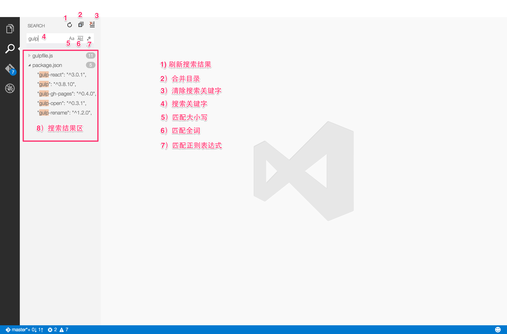
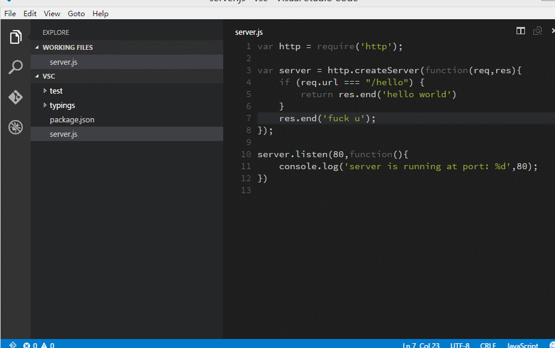
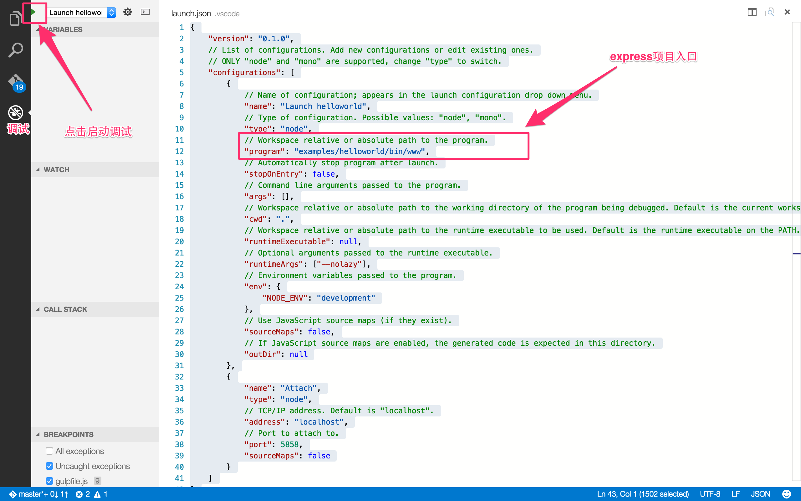
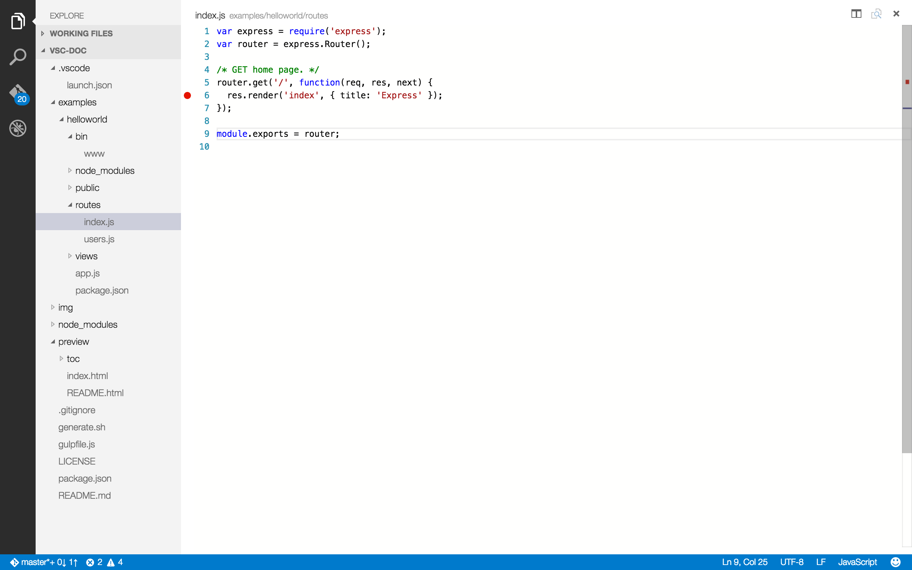
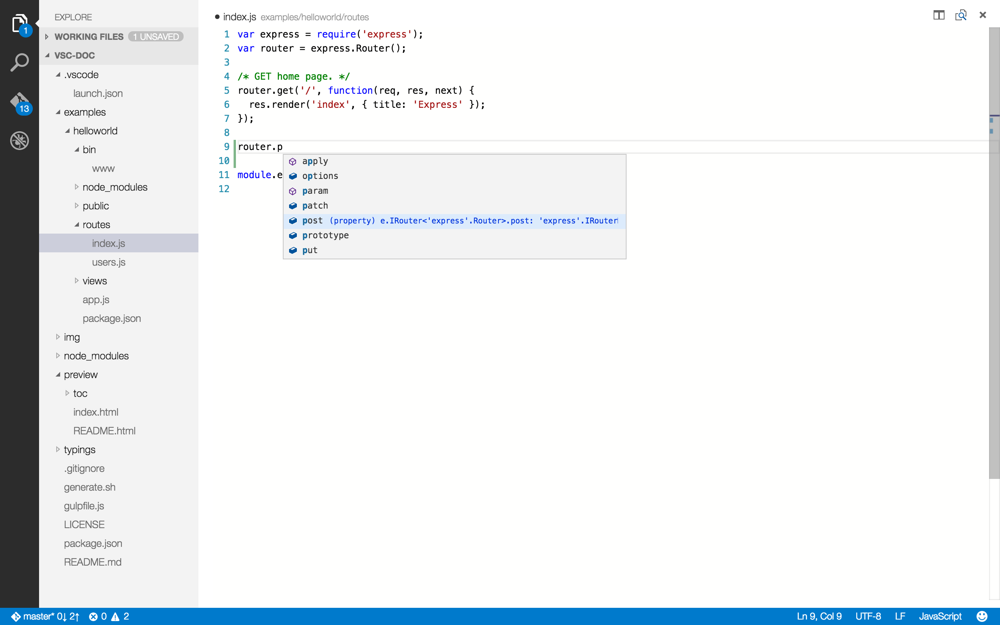
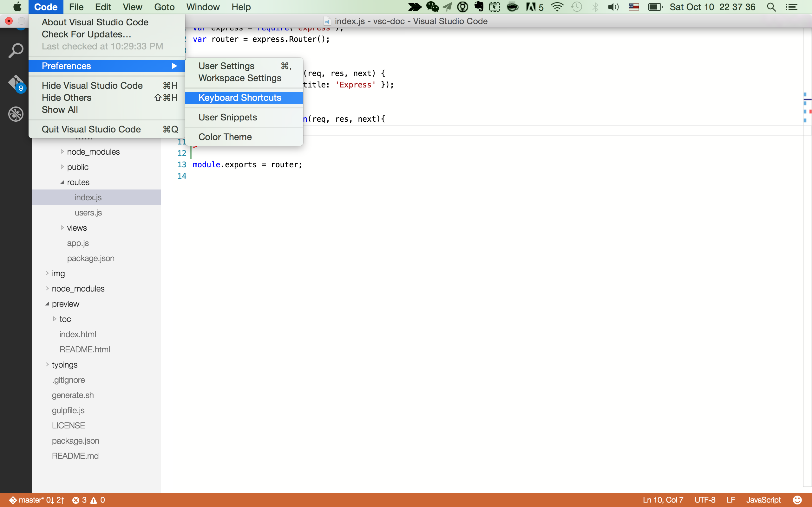
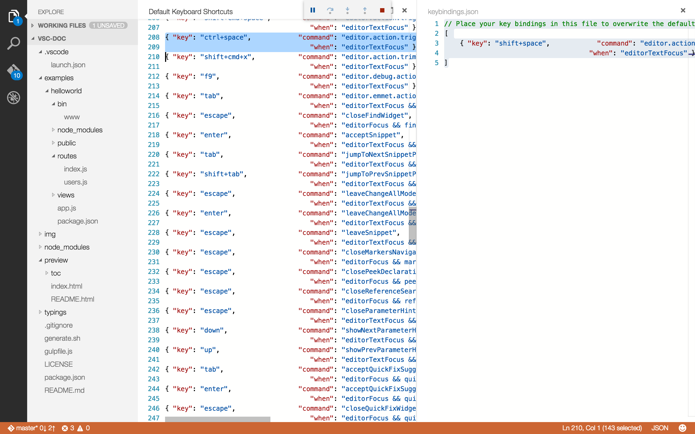
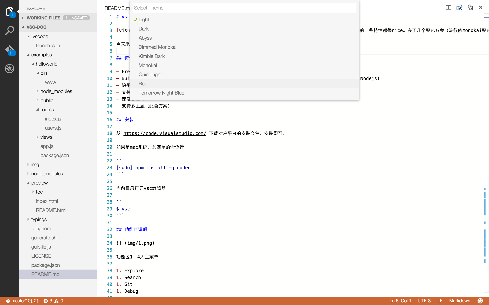
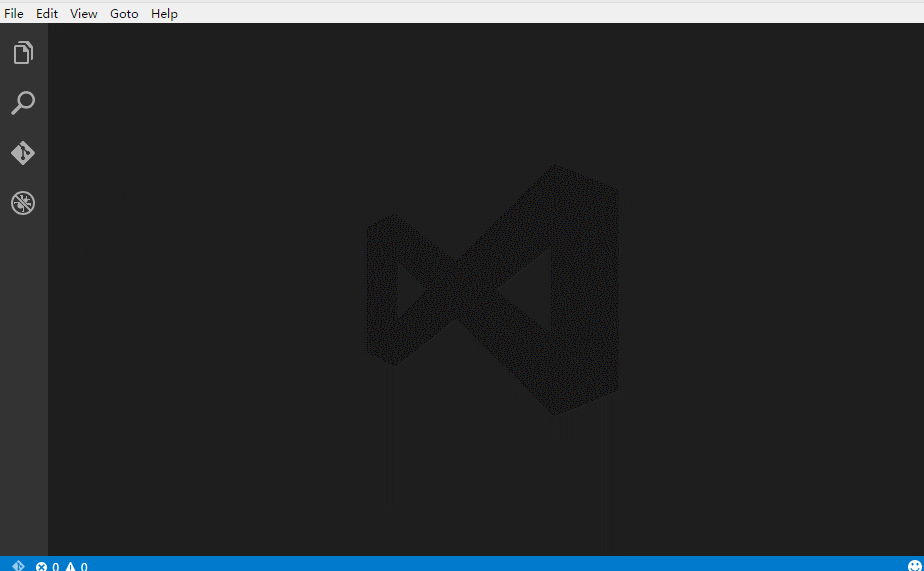

# visual studio code

[visual studio code](https://code.visualstudio.com/)（以下简称vsc）最近更新到了0.8.0版本，新加的一些特性都很nice。多了几个配色方案（流行的monokai配色也有了，虽然效果并不好），也支持自定义安装目录了。最让我感动的是对jsx文件做了语法高亮，写react的时候再也不是一片黑色了。

今天来了兴致，推荐一下，希望有更多的同学来使用这个编辑器。

## 介绍

vsc的宣传语是：

     一个运行于 Mac OS X、Windows和 Linux 之上的，针对于编写现代 Web 和云应用的跨平台源代码编辑器。

按它说的，vsc特别适合来作为前端开发编辑器。

内置html开发神器emmet(zencoding),对css及其相关编译型语言Less和Sass都有很好的支持。

当然，最nice的还是写js代码了，这也是我接下来要着重介绍的功能。

## 特性

- Free但不开源
- Build（构建）和 debug（调试） 现代web和云应用(尤其是JavaScript、TypeScript、C#、ASP.NET v5 和 Nodejs)
- 跨平台支持Linux, Mac OSX, and Windows
- 支持语法提示
- 速度非常快
- 支持多主题（配色方案）

## 安装

从 https://code.visualstudio.com/ 下载对应平台的安装文件，安装即可。

如果是mac系统，加简单的命令行

```
[sudo] npm install -g coden
```

当前目录打开vsc编辑器

```
$ vsc
```

## 功能区说明


功能区1：4大主菜单

1. Explore
1. Search
1. Git
1. Debug

功能区2：二级菜单

点击每个主菜单都会显示对应的二级菜单，比如Explore就是打开的目录，具体在后面讲解

功能区3：编辑区

我们最常用的编码区


功能区4：信息显示区

当前git信息，格式，字符编码等


```
master+ 0↓ 1↑
```

- master代表当前git分支是master分支
- 0↓ 代表远端repo没有本地的代码信息
- 1↑ 代表本地有1个提交需要push到服务器

点击此处，会弹出

```
git checkout 输入git分支名
```

切换分支,很贴心


语法校验，哪里出错，哪里有警告点击一下此处就都能看到，但不是完全准，算仅供参考吧


- Ln = line 第几行
- Col = column 第几列
- UTF-8 是字符编码
- LF 是换行方式，点击即可切换。 选项说明
  - 1）LF是line feed的缩写，中文意思是换行 
  - 2）CRLF 是carriagereturnlinefeed的缩写。中文意思是回车换行。
- Markdown 代表当前根据后缀识别的语言，用于语法高亮渲染
- ☺ 是意见反馈

## 主菜单说明

### Explore（探索）

这个菜单主要是对文件夹和文件的管理

这里有2个概念

1. WORKING FILES
1. DIR

DIR很好理解，就是你当前打开的文件夹

working files是已打开的所有文件，如果此时点击右上角的分屏按钮，可以把文件放到对应的编辑区里。


打开文件夹在菜单里，快捷键command + o

### Search




### Git


下面给出一些git学习资料（如果熟悉，自动跳过）

- [搬进 Github](http://gitbeijing.com/)
- [git-guide](http://www.bootcss.com/p/git-guide/)
- [git入门gif演示](https://git.oschina.net/wzw/git-quick-start)

### Debug（感谢hellopao）

使用方法也很简单,步骤如下：

- 打开要调试的文件，按f5,编辑器会生成一个launch.json
- 修改launch.json相关内容，主要是name和program字段，改成和你项目对应的
- 点击编辑器左侧长得像蜘蛛的那个按钮
- 点击左上角DEBUG后面的按钮，启动调试
- 打断点，尽情调试（只要你会chrome调试，一模一样）




## 实例

### 创建express项目

```
➜  examples git:(master) ✗ express helloworld

   create : helloworld
   create : helloworld/package.json
   create : helloworld/app.js
   create : helloworld/public
   create : helloworld/public/javascripts
   create : helloworld/public/images
   create : helloworld/public/stylesheets
   create : helloworld/public/stylesheets/style.css
   create : helloworld/routes
   create : helloworld/routes/index.js
   create : helloworld/routes/users.js
   create : helloworld/views
   create : helloworld/views/index.jade
   create : helloworld/views/layout.jade
   create : helloworld/views/error.jade
   create : helloworld/bin
   create : helloworld/bin/www

   install dependencies:
     $ cd helloworld && npm install

   run the app:
     $ DEBUG=helloworld:* npm start

➜  examples git:(master) ✗ cd helloworld 
➜  helloworld git:(master) ✗ npm install
➜  helloworld git:(master) ✗ npm start
```

测试express项目是正常的。

### 修改launch.json的内容

输入command + t快速定位文件：.vscode/launch.json

修改launch.json的内容

```
{
	"version": "0.1.0",
	// List of configurations. Add new configurations or edit existing ones.
	// ONLY "node" and "mono" are supported, change "type" to switch.
	"configurations": [
		{
			// Name of configuration; appears in the launch configuration drop down menu.
			"name": "Launch helloworld",
			// Type of configuration. Possible values: "node", "mono".
			"type": "node",
			// Workspace relative or absolute path to the program.
			"program": "examples/helloworld/bin/www",
			// Automatically stop program after launch.
			"stopOnEntry": false,
			// Command line arguments passed to the program.
			"args": [],
			// Workspace relative or absolute path to the working directory of the program being debugged. Default is the current workspace.
			"cwd": ".",
			// Workspace relative or absolute path to the runtime executable to be used. Default is the runtime executable on the PATH.
			"runtimeExecutable": null,
			// Optional arguments passed to the runtime executable.
			"runtimeArgs": ["--nolazy"],
			// Environment variables passed to the program.
			"env": {
				"NODE_ENV": "development"
			},
			// Use JavaScript source maps (if they exist).
			"sourceMaps": false,
			// If JavaScript source maps are enabled, the generated code is expected in this directory.
			"outDir": null
		},
		{
			"name": "Attach",
			"type": "node",
			// TCP/IP address. Default is "localhost".
			"address": "localhost",
			// Port to attach to.
			"port": 5858,
			"sourceMaps": false
		}
	]
}
```

核心内容

```
"name": "Launch helloworld",
"type": "node",
"program": "examples/helloworld/bin/www",
```

program是要执行的express的入口。

这里的helloworld是项目，所以找到/bin/www目录即可。

### 点击调试按钮



会弹出一个窗口，执行如下命令

```
cd '/Users/sang/workspace/github/vsc-doc'; env 'NODE_ENV=development'   'node' '--debug-brk=44412' '--nolazy' 'examples/helloworld/bin/www'
Debugger listening on port 44412
```

其实node-inspector也是这个原理的。

### 增加断点



### 此时访问

```
curl http://127.0.0.1:3200/
```

### 进入调试界面


和chrome的调试是一样的。

点击1）处按钮，打开控制台，配合调试，在控制台里查看对应的变量值

另外值得说明的是二级菜单里4个部分

- a）variables变量
- b）watch观察
- c）call stack 调用栈
- d）break points 断点

它和chrome的调试也是一样的，此处就不多讲了。


### 更多

- [node-debug 三法三例之node debugger + node inspector](https://cnodejs.org/topic/5463f6e872f405c829029f7e)
- [node-inspector视频](http://i5ting.github.io/nodejs-video/node-inspector.mov)
- [node-debug视频](http://i5ting.github.io/nodejs-video/node-debug.mov)

## 自动补全(智能提示)

因为之前微软推出了typescript语言，结合tsd文件，用visual studio写typescript代码是相当爽的，智能提示的功能非常nb。

这个功能理所应当也被vsc继承了。

vsc的自动补全用的是tsd。

TSD is a package manager to search and install TypeScript definition files directly from the community driven DefinitelyTyped repository.

https://github.com/DefinitelyTyped/tsd

目前主流的前端类库/框架，包括node.js及其模块/框架都有相应的tsd文件，可以去[DefinitelyTyped](https://github.com/borisyankov/DefinitelyTyped)上找一下。


那么就可以安装tsd之后，使用

```
npm install tsd -g
cd vsc-doc
tsd query -r -o -a install express
```

此时看一下当前目录，下面的express.d.ts文件即是具体提示用的。


```
typings/express/express.d.ts
```

在代码编辑区里，输入CTRL+SPACE就可以有提示了。



目前node.d.ts版本还是0.12.0，和node v4的api差不了多少


## 自定义快捷键

但是CTRL+SPACE在我的电脑里已经占用了，所以还是需要修改一下的，见下图

打开快捷键配置



修改如下




即把

```
// Place your key bindings in this file to overwrite the defaults
[
	{ "key": "ctrl+space",            "command": "editor.action.triggerSuggest",
                                     "when": "editorTextFocus" }
]
```

改成

```
// Place your key bindings in this file to overwrite the defaults
[
	{ "key": "shift+space",            "command": "editor.action.triggerSuggest",
                                     "when": "editorTextFocus" }
]
```

此时，就是输入SHIFT+SPACE就可以有提示了

原理说明：我们可以看到2个配置文件，一个是不能修改的，另一个是空的，后面的会把前面的覆盖

这其实和[jquery插件里的配置项](http://i5ting.github.io/How-to-write-jQuery-plugin/build/jquery.plugin.html#10501)原理是类似的

```
// 将defaults 和 options 参数合并到{}
var opts = $.extend({},$.fn.tab.defaults,options);
```

把options里的覆盖$.fn.tab.defaults。


## 快捷键(默认)

- 自动补全    command + SPACE
- 快速打开文件 command + o
- 快速定位文件 command + p

## 自定义主题

打开主题配置


选一个自己喜欢的主题吧




## Node API 查看（感谢hellopao）

在写node.js代码的时候，有时会忘记某个模块中有哪些方法及其用法，经常要去官网翻一下api文档。

这里介绍下怎么使用vsc来搞定这一问题。

1. 打开vsc控制台（Help > Toggle Developer Tools > Console）
1. 在控制台写代码，查询模块方法。

过程如下图：



vsc是用atom-shell(现在叫electron)写的，这玩意和node-webkit（现在叫nw.js）一样，都是把node.js和chrome结合起来的工具，所以可以这么使用。

不过vsc使用到的node.js模块并不多，比如引用util和vm等会报错，用node-webkit就不会这样。

## 结语

vsc和其他编辑器（sublime text,atom,webstorm等）相比，某些方面还存在很多问题。对于一个前端工程师来说，它已经足够好了。

推荐使用~
