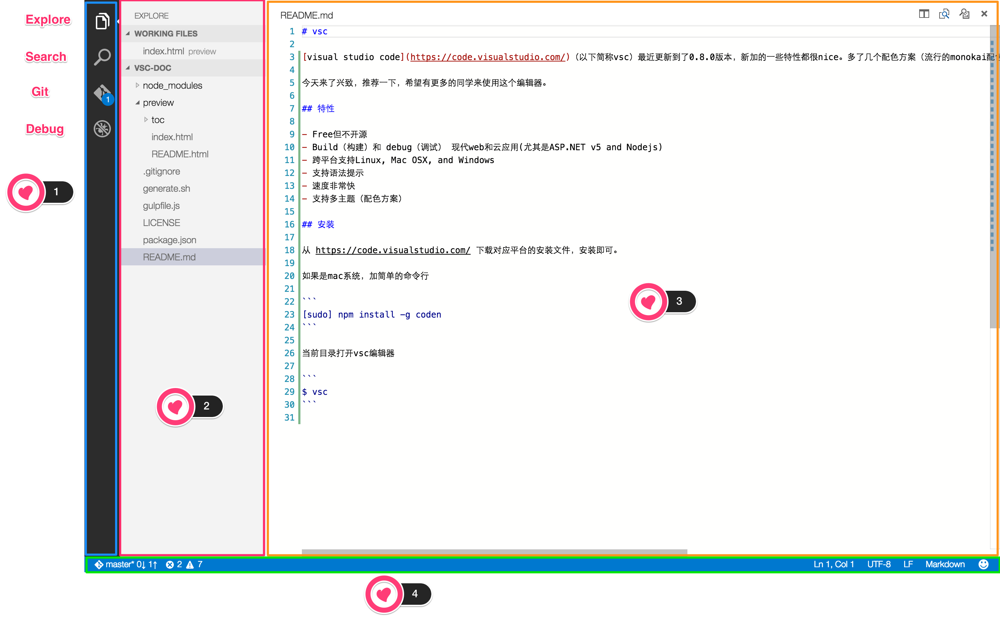
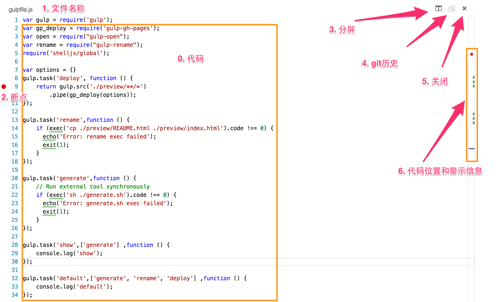
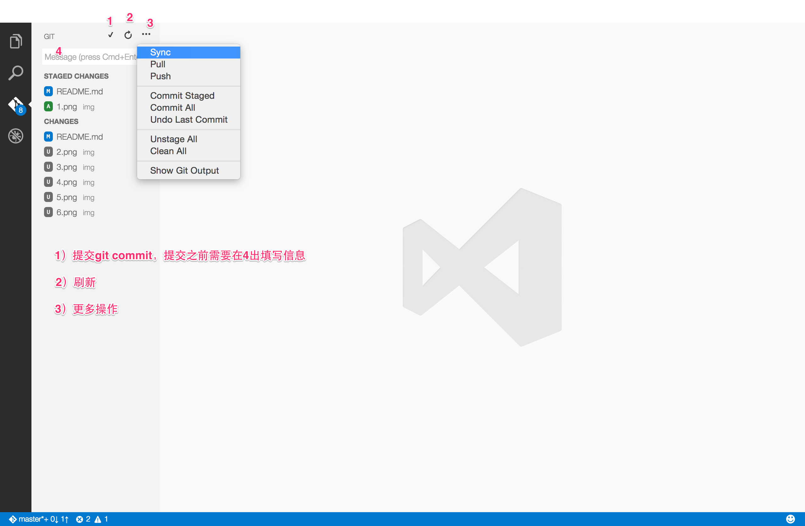
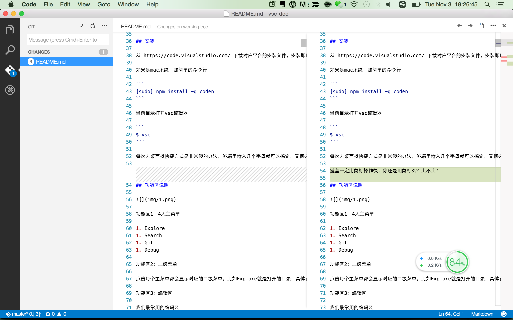
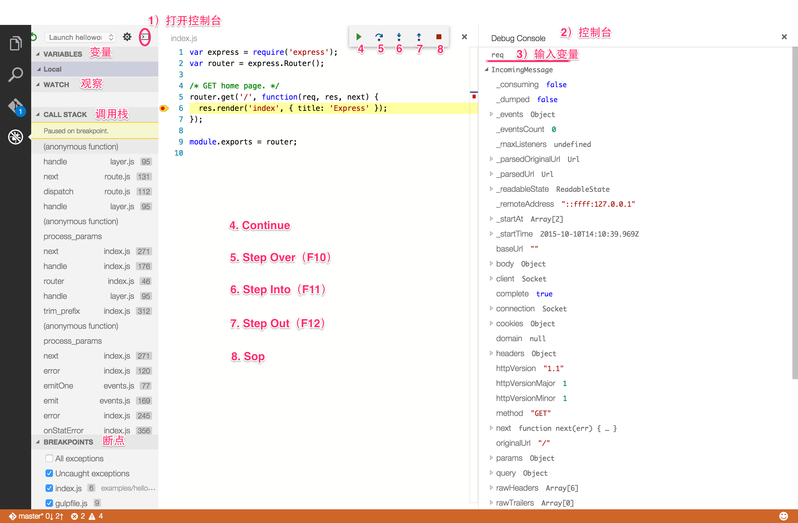
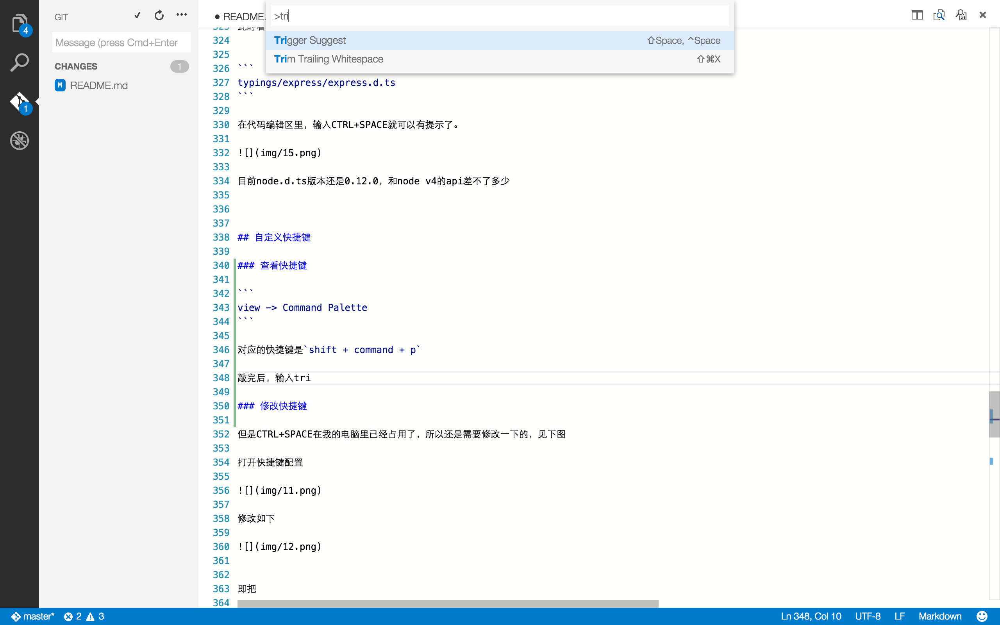
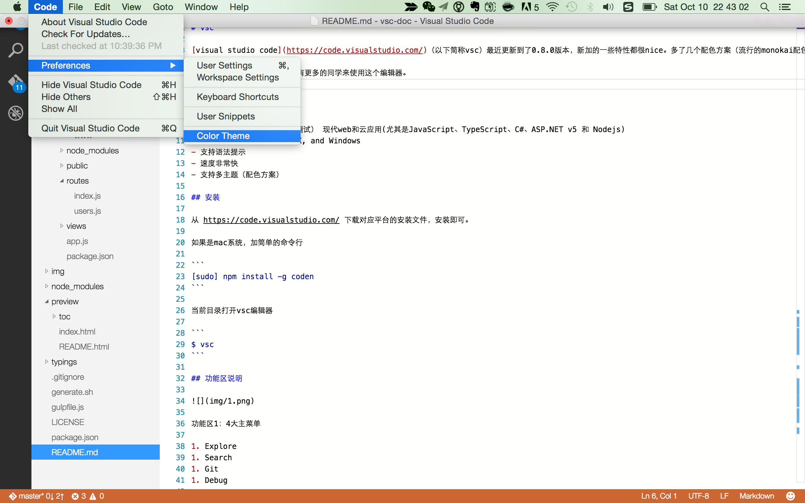
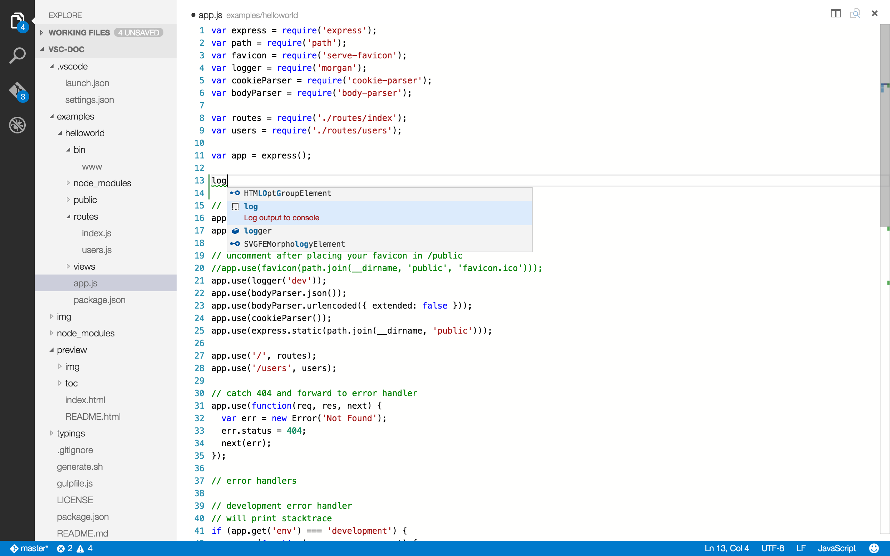
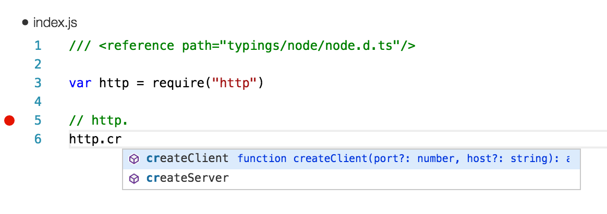
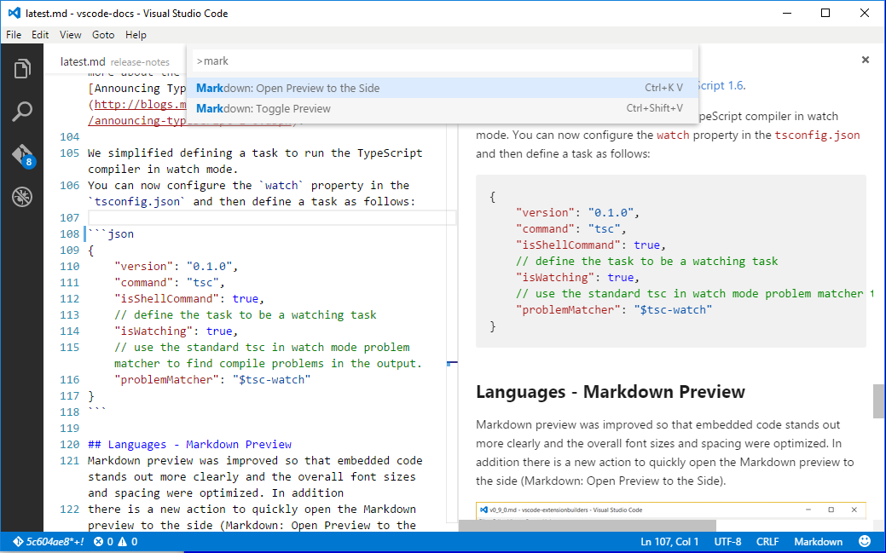

# visual studio code

[Visual Studio Code](https://code.visualstudio.com/)（以下简称vsc）最近更新到了v1.1.0版本


- vsc是一个比较潮比较新的编辑器（跨平台Mac OS X、Windows和 Linux ）
- vsc功能和textmate、sublime、notepad++，ultraedit等比较，毫不逊色
- vsc尤其是在nodejs（调试）和typescript、go上支持尤其好
- vsc提供了自定义 Debugger Adapter 和 VSCode Debug Protocol 从而实现自己的调试器

值得一学，目前在我的团队内部已经大面积推广，反馈不错

## 介绍

vsc的宣传语是：

     一个运行于 Mac OS X、Windows和 Linux 之上的，针对于编写现代 Web 和云应用的跨平台源代码编辑器。

按它说的，vsc特别适合来作为前端开发编辑器。

内置html开发神器emmet(zencoding),对css及其相关编译型语言Less和Sass都有很好的支持。

当然，最nice的还是写js代码了，这也是我接下来要着重介绍的功能。

目前vsc已经开源了：

- 代码https://github.com/Microsoft/vscode
- 官方博客http://blogs.msdn.com/b/vscode/?Redirected=true
- roadmap https://github.com/Microsoft/vscode/wiki/Roadmap
- 支持go语言 https://github.com/Microsoft/vscode-go

连mattn都在玩了https://github.com/mattn/vscode-openvim


## 特性

- Free但不开源（目前已经开源）
- Build（构建）和 debug（调试） 现代web和云应用(尤其是JavaScript、TypeScript、C#、ASP.NET v5 和 Nodejs)
- 跨平台支持Linux, Mac OSX, and Windows
- 支持语法自动补全，智能提示
- 内置html开发神器emmet
- 速度、调试效率非常快
- 支持多主题（配色方案）0.9.1之后更爽
- 对于其他编辑器的高效操作和快捷键都有继承（训练习惯的时候会讲）
- 插件系统

## 系统要求

- Ubuntu Desktop 14.04
- OS X Yosemite
- Windows 8.0, 8.1 and 10 (x86 and x64)

另外 Linux 还需要额外的

- GLIBCXX version 3.4.15 or later
- GLIBC version 2.15 or later

## 版本说明

- [标准版](https://code.visualstudio.com/Download): automatic updates on by default
- [Insiders Build](https://code.visualstudio.com/insiders)：subscribe to what we called the “Insiders Channel” which gave you get early access to monthly drops, letting you check out new features, test an extension, or even help us find that last-minute show stopper issue.


## 安装

从 https://code.visualstudio.com/ 下载对应平台的安装文件，安装即可。

如果是mac系统，加简单的命令行

```
[sudo] npm install -g coden
```

当前目录打开vsc编辑器

```
$ vsc
```

每次去桌面找快捷方式是非常傻的办法，终端里输入几个字母就可以搞定，又何必那么费劲呢？

键盘一定比鼠标操作快，你还是用鼠标么？土不土？

这个模块是nodejs写的，后面会讲

## 功能区说明



功能区1：4大主菜单

1. Explore
1. Search
1. Git
1. Debug

分别是文件夹，搜索，git和调试

功能区2：二级菜单

点击每个主菜单都会显示对应的二级菜单，比如Explore就是打开的目录，具体在后面讲解

功能区3：编辑区

我们最常用的编码区



功能区4：信息显示区

当前git信息，格式，字符编码等


```
master+ 0↓ 1↑
```

- master代表当前git分支是master分支
- 0↓ 代表远端repo没有本地的代码信息
- 1↑ 代表本地有1个提交需要push到服务器

点击此处，会弹出

```
git checkout 输入git分支名
```

切换分支,很贴心


语法校验，哪里出错，哪里有警告点击一下此处就都能看到，但不是完全准，算仅供参考吧


- Ln = line 第几行
- Col = column 第几列
- UTF-8 是字符编码
- LF 是换行方式，点击即可切换。 选项说明
  - 1）LF是line feed的缩写，中文意思是换行 
  - 2）CRLF 是carriagereturnlinefeed的缩写。中文意思是回车换行。
- Markdown 代表当前根据后缀识别的语言，用于语法高亮渲染
- ☺ 是意见反馈

稍微点评一下，微软的界面做的还是下了功夫的，细节处理的不错

Integrate with External Tools via Tasks

https://code.visualstudio.com/docs/editor/tasks

vsc还是支持各种task，Gulp, Grunt 或 Jake等

常见的各种编译，如markdown编译成html，sass编译成css，coffee或typescript编译成js等

当也有各种语法编码校验

## Workbench主菜单说明

### Explore

这个菜单主要是对文件夹和文件的管理

这里有2个概念

1. WORKING FILES
1. DIR

DIR很好理解，就是你当前打开的文件夹

working files是已打开的所有文件，如果此时点击右上角的分屏按钮，可以把文件放到对应的编辑区里。

打开文件夹在菜单里，快捷键command + o

### Search

常见的各种搜索都支持了，很强大


如果设置快捷键cmd+2，直接定位到搜索框，输入文字后，直接回车就是全文搜索

### Git

git是目前最常用的版本控制软件，推荐命令行操作，这样对原理理解的更深入，可以避免很多gui莫名其妙的问题

vsc对它进行了抽象，提供的功能，刚刚好够用



它还有diff功能，虽然大部分时间我用命令行，但我也会用它的diff和commit的



简单明了

下面给出一些git学习资料（如果熟悉，自动跳过）

- [搬进 Github](http://gitbeijing.com/)
- [git-guide](http://www.bootcss.com/p/git-guide/)
- [git入门gif演示](https://git.oschina.net/wzw/git-quick-start)

要注意：vsc不提供创建git项目功能，所以需要先创建git项目，然后打开再用它编辑

### Debug

为什么选用vsc，一个原因就是因为调试

- node-inspector虽好，项目已大特别慢，这方面vsc做了不少优化
- tdd/bdd虽好，还不能完全实现

vsc官方说

    We improved stepping performance by loading the scopes and variables 
    of stack frames lazily. This improvement is based on a protocol change
    that affects all debug adapters.

意思就是他们做了很多优化

使用中，确实比node-inspector快很多

vsc调试使用方法也很简单,步骤如下：

- 打开要调试的文件，按f5,编辑器会生成一个launch.json
- 修改launch.json相关内容，主要是name和program字段，改成和你项目对应的
- 点击编辑器左侧长得像蜘蛛的那个按钮
- 点击左上角DEBUG后面的按钮，启动调试
- 打断点，尽情调试（只要你会chrome调试，一模一样）


## express调试实例

这是我们最常用的调试

通过创建express项目构建，调试来演示vsc的具体用法

### 创建express项目

使用express-generator

```
➜  examples git:(master) ✗ express helloworld

   create : helloworld
   create : helloworld/package.json
   create : helloworld/app.js
   create : helloworld/public
   create : helloworld/public/javascripts
   create : helloworld/public/images
   create : helloworld/public/stylesheets
   create : helloworld/public/stylesheets/style.css
   create : helloworld/routes
   create : helloworld/routes/index.js
   create : helloworld/routes/users.js
   create : helloworld/views
   create : helloworld/views/index.jade
   create : helloworld/views/layout.jade
   create : helloworld/views/error.jade
   create : helloworld/bin
   create : helloworld/bin/www

   install dependencies:
     $ cd helloworld && npm install

   run the app:
     $ DEBUG=helloworld:* npm start

➜  examples git:(master) ✗ cd helloworld 
➜  helloworld git:(master) ✗ npm install
➜  helloworld git:(master) ✗ npm start
```

测试express项目是正常的。

说明：如果是自己的项目，需要自己构建git版本控制的，faq里有具体说明。

### 修改launch.json的内容

输入command + t快速定位文件：.vscode/launch.json

修改launch.json的内容

```
{
	"version": "0.1.0",
	// List of configurations. Add new configurations or edit existing ones.
	// ONLY "node" and "mono" are supported, change "type" to switch.
	"configurations": [
		{
			// Name of configuration; appears in the launch configuration drop down menu.
			"name": "Launch helloworld",
			// Type of configuration. Possible values: "node", "mono".
			"type": "node",
			// Workspace relative or absolute path to the program.
			"program": "examples/helloworld/bin/www",
			// Automatically stop program after launch.
			"stopOnEntry": false,
			// Command line arguments passed to the program.
			"args": [],
			// Workspace relative or absolute path to the working directory of the program being debugged. Default is the current workspace.
			"cwd": ".",
			// Workspace relative or absolute path to the runtime executable to be used. Default is the runtime executable on the PATH.
			"runtimeExecutable": null,
			// Optional arguments passed to the runtime executable.
			"runtimeArgs": ["--nolazy"],
			// Environment variables passed to the program.
			"env": {
				"NODE_ENV": "development"
			},
			// Use JavaScript source maps (if they exist).
			"sourceMaps": false,
			// If JavaScript source maps are enabled, the generated code is expected in this directory.
			"outDir": null
		},
		{
			"name": "Attach",
			"type": "node",
			// TCP/IP address. Default is "localhost".
			"address": "localhost",
			// Port to attach to.
			"port": 5858,
			"sourceMaps": false
		}
	]
}
```

核心内容

```
"name": "Launch helloworld",
"type": "node",
"program": "examples/helloworld/bin/www",
```

program是要执行的express的入口。

这里的helloworld是项目，所以找到/bin/www目录即可。

### 点击调试按钮


会弹出一个窗口，执行如下命令

```
cd '/Users/sang/workspace/github/vsc-doc'; env 'NODE_ENV=development'   'node' '--debug-brk=44412' '--nolazy' 'examples/helloworld/bin/www'
Debugger listening on port 44412
```

其实node-inspector也是这个原理的。

### 增加断点


### 此时访问

```
curl http://127.0.0.1:3200/
```

### 进入调试界面



和chrome的调试是一样的。

点击1）处按钮，打开控制台，配合调试，在控制台里查看对应的变量值

另外值得说明的是二级菜单里4个部分

- a）variables变量
- b）watch观察
- c）call stack 调用栈
- d）break points 断点

它和chrome的调试也是一样的，此处就不多讲了。

### 更多

- [node-debug 三法三例之node debugger + node inspector](https://cnodejs.org/topic/5463f6e872f405c829029f7e)
- [node-inspector视频](http://i5ting.github.io/nodejs-video/node-inspector.mov)
- [node-debug视频](http://i5ting.github.io/nodejs-video/node-debug.mov)

课后作业：亲手debug一次，感受一下vsc的魅力

## 自动补全(智能提示)

因为之前微软推出了typescript语言，结合tsd文件，用visual studio写typescript代码是相当爽的，智能提示的功能非常nb。

这个功能理所应当也被vsc继承了。

vsc的自动补全用的是typings。

The TypeScript Definition Manager（之前的tsd已经弃用了，faq里有说明）

https://github.com/typings/typings

和npm很像，有木有？

目前主流的前端类库/框架，包括node.js及其模块/框架都有相应的tsd文件，可以去[typings](https://github.com/typings/registry)上找一下。


那么就可以安装typings之后，使用

```
npm install typings --global
cd vsc-doc
typings install node express --ambient --save
```

和npm很像，有木有？

此时看一下当前目录，下面的express.d.ts文件即是具体提示用的。


```
typings/express/express.d.ts
```

在代码编辑区里，输入CTRL+SPACE(默认快捷键)就可以有提示了。


目前node.d.ts版本还是0.12.0，和node v4的api差不了多少（最新的已经是4.x了）

## 自定义快捷键

上面是基本的操作，下面看点高效的使用：自定义快捷键

### 查看快捷键

菜单view里找 Command Palette项

```
view -> Command Palette（调色板）
```

对应的快捷键是`shift + command + p`

敲完后，输入`tri`



### 修改快捷键

但是CTRL+SPACE在我的电脑里已经占用了，所以还是需要修改一下的，见下图

打开快捷键配置


修改如下


即把

```
// Place your key bindings in this file to overwrite the defaults
[
	{ "key": "ctrl+space",            "command": "editor.action.triggerSuggest",
                                     "when": "editorTextFocus" }
]
```

改成

```
// Place your key bindings in this file to overwrite the defaults
[
	{ "key": "shift+space",            "command": "editor.action.triggerSuggest",
                                     "when": "editorTextFocus" }
]
```

此时，就是输入SHIFT+SPACE就可以有提示了

说明：key就是快捷键，command是编辑器的操作

### Workbench主菜单快捷键

熟悉mac的都知道folder里的cmd+1|2|3|4切换文件夹显示，其实我们也可以使用类似的快捷键来提高工作效率

xcode里面也是，所以command键是我最常用的快捷键


推荐配置如下，按照顺序来，好记

```
	{ "key": "cmd+1",           "command": "workbench.view.explorer" },
	{ "key": "cmd+2",           "command": "workbench.view.search" },
	{ "key": "cmd+3",           "command": "workbench.view.git" },
	{ "key": "cmd+4",           "command": "workbench.view.debug" }
```

这样配置可以让大拇指最少移动，以大拇指为中心，快速切换，速度非常快

### working files切换

一个编辑区里，vsc是不缓存的，毕竟是js写的，相对较弱，这其实是vsc的一个优化

所以cmd + p 打开了文件之后，之前的文件就找不到了

实际上都存到working files里了，只要我们切换working files即可

mac下`ctrl + -`和`shift+ctrl + -`切换当前working files

还是很爽的

### 快捷键配置原理

原理说明：我们可以看到2个配置文件，一个是不能修改的，另一个是空的，后面的会把前面的覆盖

这其实和[jquery插件里的配置项](http://i5ting.github.io/How-to-write-jQuery-plugin/build/jquery.plugin.html#10501)原理是类似的

```
// 将defaults 和 options 参数合并到{}
var opts = $.extend({},$.fn.tab.defaults,options);
```

把options里的覆盖$.fn.tab.defaults。

合并后的的配置项，再和{}合并，至少保证配置是{}

## 快捷键(默认)

- 自动补全    command + SPACE
- 快速打开文件 command + o
- 快速定位文件 command + p
- 分割编辑窗口 command + \ 
- 关闭当前窗口 command + w
- 隐藏二级菜单 command + b
- 放大 command + =
- 缩小 command + -
- 插入表情 ctrl + command + space
- 列编辑 alt + shift 然后使用鼠标点选即可，也算是比较实用
- 跳转行 ctrl + g

搜索

- 当前文档里搜索 command + -
- 所有文档里搜索 shift + command + -

## 我的玩法（常用快捷键）

- `ctrl + command + f` 放大到全屏
- 设置Workbench主菜单快捷键，然后就有了`command + 1到4`的快捷键，快速切换
- `command + b` 显示或隐藏（奇数次和偶数次）二级菜单，让可视区更大
- 可视区内`command + \` 新建编辑窗口（尤其是markdown里面，一个编写，一个预览`shift + command + v`）
- 可视区内`command + w` 关闭编辑窗口
- `command + p` 快速打开文件
- 使用`ctrl + -`或者`shift + ctrl + -`切换working files
- 当前文档里搜索 `command + -`
- 所有文档里搜索 `shift + command + -`
- `shift + opt + f`格式化
- 跳转行 command + l（保持和textmate一致）
- `ctrl + ~`打开或关闭terminal （v1.2新增功能）

具体配置见[keyboard.json](./keyboard.json)

## 配置文件

### jsconfig.json

最新的1.0版本，右下角会有个💡提示创建jsconfig.json

jsconfog.json要和typings在同级目录

详见 https://code.visualstudio.com/Docs/languages/javascript


### tsconfig.json

TODO: 稍后不出
## 语音控制

fn fn

待测

## 自定义主题

打开主题配置



选一个自己喜欢的主题吧


## html开发神器emmet（Zen coding）

举个简单例子，在index.html里

输入link，然后tab键，就会生成下面的代码

```
<link rel="stylesheet" href="">
```

连续输入类和id，比如p.bar#foo，会自动生成： 

```
<p class="bar" id="foo"></p>  
```

输入h1{foo}和a[href=#]，就可以自动生成如下代码：

```
<h1>foo</h1>  
<a href="#"></a>  
```

写html代码足够快了，享受吧，更多用法见 

- http://www.iteye.com/news/27580
- http://docs.emmet.io/

写其他语言也有这样的神奇，见后面讲的code snippets章节

## Node API 查看

在写node.js代码的时候，有时会忘记某个模块中有哪些方法及其用法，经常要去官网翻一下api文档。

这里介绍下怎么使用vsc来搞定这一问题。

1. 打开vsc控制台（Help > Toggle Developer Tools > Console）
2. 在控制台写代码，查询模块方法。

过程如下图：


vsc是用atom-shell(现在叫electron)写的，这玩意和node-webkit（现在叫nw.js）一样，都是把node.js和chrome结合起来的工具，所以可以这么使用。

不过vsc使用到的node.js模块并不多，比如引用util和vm等会报错，用node-webkit就不会这样。

更好的查看api办法是使用docset查看文档，比如zeal或dash（后面会讲）

## 缓存文件

按照一般app的设计，都是主应用，和用户目录下的缓存文件，把用户自定义的或使用生成的文件都放到缓存文件目录里。鉴于此，我们来找找code.app的缓存文件，或许能发现点有用的东西

可参照 https://code.visualstudio.com/docs/customization/userandworkspace 理解

### 缓存目录详情

目录是 `/Users/sang/Library/Application Support/Code` 

```
➜  Code  pwd
/Users/sang/Library/Application Support/Code
➜  Code  tree . -L 2
.
├── DevTools Extensions
├── File System
│   ├── 000
│   └── Origins
├── GPUCache
│   ├── data_0
│   ├── data_1
│   ├── data_2
│   ├── data_3
│   └── index
├── Local Storage
│   ├── chrome-devtools_devtools_0.localstorage
│   ├── chrome-devtools_devtools_0.localstorage-journal
│   ├── file__0.localstorage
│   └── file__0.localstorage-journal
├── QuotaManager
├── QuotaManager-journal
├── User
│   ├── keybindings.json
│   ├── launch.json
│   └── snippets
├── databases
│   ├── Databases.db
│   └── Databases.db-journal
└── storage.json

8 directories, 17 files
```

这些文件我们能看懂的就尽量看，看不懂的也无所谓，如果想深度了解里面的机制，还是有必要看看的。

### storage.json

storage.json是code.app的核心配置文件，就像npm里的package.json一样。

看一下具体内容

```
➜  Code  cat storage.json 
{
    "updateChannel": "stable",
    "windowUIState": {
        "width": 1280,
        "height": 773,
        "mode": 1,
        "x": 0,
        "y": 23
    },
    "openedPathsList": {
        "folders": [],
        "files": [
            "/Users/sang/Library/Application Support/Code/User/snippets/javascript.json",
            "/Users/sang/workspace/github/vsc-doc/typings/node/node.d.ts",
            "/Users/sang/workspace/github/vsc-doc",
            "/Users/sang/workspace/github/vsc/index.js",
            "/Users/sang/workspace/moa/rate-cache",
            "/Users/sang/workspace/aircos/aircos-plugins",
            "/Users/sang/workspace/github/vsc",
            "/Users/sang/test/go",
            "/Users/sang/test/go/views"
        ]
    },
    "theme": "vs",
    "folderPickerWorkingDir": "/Users/sang/workspace/moa",
    "lastActiveOpenedPath": "/Users/sang/workspace/github/vsc-doc"
}% 
```

说明

- updateChannel 应该检查版本更新的设置
- windowUIState 界面状态，还记得分割编辑窗口吧？
- openedPathsList 应该是File -> Open Recent里的内容
- theme 用户配色方案
- folderPickerWorkingDir 执行command + o 打开的目录
- lastActiveOpenedPath   最后打开的目录（这个目录是我执行vsc直接打开的）

为什么要了解它呢？

如果你理解了上面的配置起什么作用，那么你是不是可以干很多坏事儿呢？比如

- 备份
- 可视化
- 其他hack

剩下的自己发挥吧

### 当前用户配置

上面的目录结构基本都可以看懂，对应当前用户来说

```
├── User
│   ├── keybindings.json(用户自定义的快捷键)
│   ├── launch.json(调试加载的文件)
│   └── snippets
```

### 用户快捷键

比如快捷键

```
➜  Code  cat User/keybindings.json 
// Place your key bindings in this file to overwrite the defaults
[
	{ "key": "ctrl+f12",                   "command": "editor.action.goToDeclaration",
                                     "when": "editorTextFocus" },
	{ "key": "shift+space",            "command": "editor.action.triggerSuggest",
                                     "when": "editorTextFocus" }
]%       
```

是不是和我们之前配置的一样?

### 用户调试加载的文件

```
User/launch.json
```

和上面的是一样的，就不打印了。如果想每次都定义一下的话，可以自己修改，以后对当前用户就是全局的了

### snippets

User/snippets是snippets存放位置，比如javascript的定义

见

```
User/snippets/javascript.json
```

snippets中文是代码片段，是自定义智能提示用的

### 自定义snippet

```
	 // Place your snippets for JavaScript here. Each snippet is defined under a snippet name and has a prefix, body and 
	 // description. The prefix is what is used to trigger the snippet and the body will be expanded and inserted. Possible variables are:
	 // $1, $2 for tab stops, ${id} and ${id:label} and ${1:label} for variables. Variables with the same id are connected.
	 // Example:
	 "Print to console": {
		"prefix": "log",
		"body": [
			"console.log('$1');",
			"$2"
		],
		"description": "Log output to console"
	}
```

说明：

- "Print to console" 是智能提示显示的
- "prefix" 是用户输入的字母，比如本例中输入log自动提示
- 当用户触发此snippet的时候，会按照"body"里代码生成
- $1代表光标位置

自己按照上面的方法定义自己的snippets，可以提高很多工作效率哦

下面看一下如何在代码中使用snippet，如图



和vim、nodepad++里的录制宏类似

## 庖丁解牛code.app

- electron 打包成可执行文件
- 使用了一些atom模块、第三方模块

app的安装目录是 `/Applications/Visual\ Studio\ Code.app`,右键show package content，然后一层一层的找里面的内容就可以了

```
/Applications/Visual\ Studio\ Code.app/Contents/Resources
```

下面我们来看一下里面的内容

```
➜  Resources  pwd
/Applications/Visual Studio Code.app/Contents/Resources
➜  Resources  tree . -L 3
.
├── Code.icns
├── Credits.rtf
├── app
│   ├── Credits_43.0.2357.65.html
│   ├── ThirdPartyNotices.txt
│   ├── license.txt
│   ├── node_modules
│   │   ├── applicationinsights
│   │   ├── chokidar
│   │   ├── emmet
│   │   ├── first-mate
│   │   ├── getmac
│   │   ├── graceful-fs
│   │   ├── http-proxy-agent
│   │   ├── https-proxy-agent
│   │   ├── iconv-lite
│   │   ├── sax
│   │   ├── semver
│   │   └── winreg
│   ├── out
│   │   ├── bootstrap.js
│   │   └── vs
│   ├── package.json
│   ├── plugins
│   │   ├── declares.d.ts
│   │   ├── lib.core.d.ts
│   │   ├── node.d.ts
│   │   ├── tsconfig.json
│   │   ├── vs.debug.mono
│   │   ├── vs.debug.node
│   │   ├── vs.language.bat
│   │   ├── vs.language.clojure
│   │   ├── vs.language.coffeescript
│   │   ├── vs.language.cpp
│   │   ├── vs.language.csharp
│   │   ├── vs.language.csharp.o
│   │   ├── vs.language.css
│   │   ├── vs.language.dockerfile
│   │   ├── vs.language.fsharp
│   │   ├── vs.language.go
│   │   ├── vs.language.groovy
│   │   ├── vs.language.html
│   │   ├── vs.language.ini
│   │   ├── vs.language.jade
│   │   ├── vs.language.java
│   │   ├── vs.language.javascript
│   │   ├── vs.language.lua
│   │   ├── vs.language.makefile
│   │   ├── vs.language.markdown
│   │   ├── vs.language.objective-c
│   │   ├── vs.language.perl
│   │   ├── vs.language.php
│   │   ├── vs.language.powershell
│   │   ├── vs.language.python
│   │   ├── vs.language.r
│   │   ├── vs.language.ruby
│   │   ├── vs.language.rust
│   │   ├── vs.language.shellscript
│   │   ├── vs.language.swift
│   │   ├── vs.language.tsql
│   │   ├── vs.language.typescript
│   │   ├── vs.language.vb
│   │   ├── vs.language.xml
│   │   ├── vs.language.yaml
│   │   ├── vs.linter.eslint
│   │   ├── vs.linter.jshint
│   │   └── vs.theme.starterkit
│   └── vso.png
├── atom.asar
├── en.lproj
├── en_GB.lproj
├── file.icns
├── zh_CN.lproj
└── zh_TW.lproj

60 directories, 14 files
```


### 依赖的模块

```
│   ├── node_modules
│   │   ├── applicationinsights
│   │   ├── chokidar
│   │   ├── emmet
│   │   ├── first-mate
│   │   ├── getmac
│   │   ├── graceful-fs
│   │   ├── http-proxy-agent
│   │   ├── https-proxy-agent
│   │   ├── iconv-lite
│   │   ├── sax
│   │   ├── semver
│   │   └── winreg
```

### 插件

```
│   ├── plugins
│   │   ├── declares.d.ts
│   │   ├── lib.core.d.ts
│   │   ├── node.d.ts
│   │   ├── tsconfig.json
│   │   ├── vs.debug.mono
│   │   ├── vs.debug.node
│   │   ├── vs.language.bat
│   │   ├── vs.language.clojure
│   │   ├── vs.language.coffeescript
│   │   ├── vs.language.cpp
│   │   ├── vs.language.csharp
│   │   ├── vs.language.csharp.o
│   │   ├── vs.language.css
│   │   ├── vs.language.dockerfile
│   │   ├── vs.language.fsharp
│   │   ├── vs.language.go
│   │   ├── vs.language.groovy
│   │   ├── vs.language.html
│   │   ├── vs.language.ini
│   │   ├── vs.language.jade
│   │   ├── vs.language.java
│   │   ├── vs.language.javascript
│   │   ├── vs.language.lua
│   │   ├── vs.language.makefile
│   │   ├── vs.language.markdown
│   │   ├── vs.language.objective-c
│   │   ├── vs.language.perl
│   │   ├── vs.language.php
│   │   ├── vs.language.powershell
│   │   ├── vs.language.python
│   │   ├── vs.language.r
│   │   ├── vs.language.ruby
│   │   ├── vs.language.rust
│   │   ├── vs.language.shellscript
│   │   ├── vs.language.swift
│   │   ├── vs.language.tsql
│   │   ├── vs.language.typescript
│   │   ├── vs.language.vb
│   │   ├── vs.language.xml
│   │   ├── vs.language.yaml
│   │   ├── vs.linter.eslint
│   │   ├── vs.linter.jshint
│   │   └── vs.theme.starterkit
```

很多人抱怨，vsc没有提供插件机制，想想还是笑笑吧，机制已经很健全了，开放只是早晚的事儿。

### out目录

out是一个比较有趣的目录，所有代码都是混淆过的，但可以从其文件名和目录名称看出一些东西

```
➜  out  pwd
/Applications/Visual Studio Code.app/Contents/Resources/app/out
➜  out  tree . -L 3
.
├── bootstrap.js
└── vs
    ├── base
    │   ├── browser
    │   ├── common
    │   ├── node
    │   ├── parts
    │   └── worker
    ├── css.js
    ├── editor
    │   ├── browser
    │   ├── common
    │   ├── contrib
    │   └── css
    ├── languages
    │   ├── annotatedLanguage
    │   ├── csharp
    │   ├── css
    │   ├── handlebars
    │   ├── html
    │   ├── javascript
    │   ├── json
    │   ├── less
    │   ├── lib
    │   ├── markdown
    │   ├── php
    │   ├── plaintext
    │   ├── razor
    │   ├── sass
    │   ├── typescript
    │   ├── typescript.workbench
    │   └── vsxml
    ├── loader.js
    ├── nls.js
    ├── text.js
    └── workbench
        ├── browser
        ├── electron-browser
        ├── electron-main
        ├── parts
        ├── services
        ├── workbench.main.css
        ├── workbench.main.js
        ├── workbench.main.nls.js
        └── workbench.main.nls.keys.js

36 directories, 9 files
```

bootstrap.js是启动的脚本


默认支持的语言

- annotatedLanguage
- csharp
- css
- handlebars
- html
- javascript
- json
- less
- markdown
- php
- plaintext
- razor
- sass
- typescript
- vsxml

vs/base/browser/ui/是界面里用的svg图，如果想自定义界面可以自行修改

vs/base/node/terminateProcess.sh写的不错

```
#!/bin/bash

terminateTree() {
    for cpid in $(pgrep -P $1); do
        terminateTree $cpid
    done
    kill -9 $1 > /dev/null 2>&1
}

for pid in $*; do
    terminateTree $pid
done
```


/Applications/Visual Studio Code.app/Contents/Resources/app/out/vs/editor/css是编辑器vs-theme.css样式


/Applications/Visual Studio Code.app/Contents/Resources/app/out/vs/workbench/browser/css是workbench的vs-theme.css样式

### ThirdPartyNotices.txt

看看它依赖的第三方开源模块

```
1.	amdefine version 1.0.0 (https://github.com/jrburke/amdefine)
2.	anymatch version 1.3.0 (https://github.com/es128/anymatch)
3.	App Insights for Node.js version 0.15.5 (https://github.com/Microsoft/ApplicationInsights-node.js/tree/master)
4.	array-slice version 0.2.3 (https://github.com/jonschlinkert/array-slice)
5.	arr-diff version 1.0.1 (https://github.com/jonschlinkert/arr-diff/tree/1.0.1)
6.	arrify version 1.0.0 (https://github.com/sindresorhus/arrify)
7.	Async-each version 0.1.6 (https://github.com/paulmillr/async-each)
8.	atom-brightray (https://github.com/atom/brightray)
9.	binary-extensions version 1.3.1 (https://github.com/sindresorhus/binary-extensions)
10.	braces version 1.8.0 (https://github.com/jonschlinkert/braces)
11.	chjj-marked version 0.3.2 (https://github.com/npmcomponent/chjj-marked)
12.	chokidar version 1.0.0 (https://github.com/paulmillr/chokidar)
13.	chromium version 43.0.2357.65 (http://www.chromium.org/Home)
14.	Colorsublime-Themes version 0.1.0 (https://github.com/Colorsublime/Colorsublime-Themes)
15.	Core-util-is version 1.0.1 (https://github.com/isaacs/core-util-is/)
16.	debug version 2.2.0 (https://github.com/visionmedia/debug)
17.	debug version 1.0.4 (https://github.com/visionmedia/debug)
18.	debugger-libs version 9.0.21022 (https://github.com/mono/debugger-libs)
19.	electron version 0.27.3 (https://github.com/atom/electron)
20.	emmet version 1.3.1 (https://github.com/emmetio/emmet)
21.	expand-brackets version 0.1.1 (https://github.com/jonschlinkert/expand-brackets)
22.	expand-range version 1.8.1 (https://github.com/jonschlinkert/expand-range)
23.	Extract-opts version 2.2.0 (https://github.com/bevry/extract-opts)
24.	filename-regex version 2.0.0 (https://github.com/regexps/filename-regex)
25.	fill-range version 2.2.2 (https://github.com/jonschlinkert/fill-range)
26.	firstmate (alexandrudima) version 4.1.7 (https://github.com/alexandrudima/first-mate)
27.	for-in version 0.1.4 (https://github.com/jonschlinkert/for-in)
28.	for-own version 0.1.3 (https://github.com/jonschlinkert/for-own)
29.	fsevents version 0.3.6 (https://github.com/strongloop/fsevents)
30.	getmac version 1.0.7 (https://github.com/bevry/getmac)
31.	glob-base version 0.2.0 (https://github.com/jonschlinkert/glob-base)
32.	glob-parent version 1.2.0 (https://github.com/es128/glob-parent)
33.	graceful-fs version 4.1.2 (https://github.com/isaacs/node-graceful-fs)
34.	http-proxy-agent version 0.2.6 (https://github.com/TooTallNate/node-http-proxy-agent)
35.	https-proxy-agent version 0.3.5 (https://github.com/TooTallNate/node-https-proxy-agent)
36.	iconv-lite version 0.4.10 (https://github.com/ashtuchkin/iconv-lite)
37.	Inherits version 2.0.1 (https://github.com/isaacs/inherits)
38.	Isarray version 0.0.1 (https://github.com/juliangruber/isarray)
39.	is-binary-path version 1.0.1 (https://github.com/sindresorhus/is-binary-path)
40.	is-dotfile version 1.0.1 (ttps://github.com/jonschlinkert/is-dotfile)
41.	Is-equal-shallow version 0.1.2 (https://github.com/jonschlinkert/is-equal-shallow)
42.	is-extglob version 1.0.0 (https://github.com/jonschlinkert/is-extglob)
43.	is-glob version 1.1.3 (https://github.com/jonschlinkert/is-glob)
44.	is-number version 1.1.2 (https://github.com/jonschlinkert/is-number)
45.	isobject version 1.0.0 (https://github.com/jonschlinkert/isobject)
46.	isobject version 0.2.0 (https://github.com/jonschlinkert/isobject)
47.	Is-primitive version 1.0.0 (https://github.com/jonschlinkert/is-primitive)
48.	Is-primitive version 2.0.0 (https://github.com/jonschlinkert/is-primitive)
49.	issrc (Inno Setup) version 5.5.6 (https://github.com/jrsoftware/issrc)
50.	jsbeautifer version 1.5.10 (https://github.com/beautify-web/js-beautify)
51.	kind-of version 1.1.0 (https://github.com/jonschlinkert/kind-of)
52.	language-closure version 0.16.0 (https://github.com/atom/language-clojure)
53.	language-groovy version 0.4.0 (https://github.com/Jakehp/language-groovy)
54.	language-make version 0.17.0 (https://github.com/atom/language-make)
55.	language-perl version 0.28.0 (https://github.com/atom/language-perl)
56.	language-php version 0.29.0 (https://github.com/atom/language-php)
57.	language-rust version 0.4.4 (https://github.com/zargony/atom-language-rust)
58.	language-shellscript version 0.15.0 (https://github.com/atom/language-shellscript)
59.	language-yaml version 0.24.0 (https://github.com/atom/language-yaml)
60.	Libchromiumcontent version 43.0.2357.65 (https://github.com/atom/libchromiumcontent)
61.	Lru-cache version 2.6.4 (https://github.com/isaacs/node-lru-cache)
62.	micromatch version 2.1.6 (https://github.com/jonschlinkert/micromatch/tree/2.1.5)
63.	minimatch version 0.2.14 (https://github.com/isaacs/minimatch)
64.	ms version 0.7.1 (https://github.com/rauchg/ms.js)
65.	ms.js version 0.6.2 (https://github.com/rauchg/ms.js)
66.	nan version 1.8.4 (https://github.com/iojs/nan)
67.	newtonsoft.json version 6.0.8 (https://github.com/JamesNK/Newtonsoft.Json)
68.	node-agent-base version 1.0.1 (https://github.com/TooTallNate/node-agent-base/)
69.	node-extend version 1.2.1 (https://github.com/justmoon/node-extend)
70.	NodeJS version 0.10.29 (http://nodejs.org/dist/v0.10.29/)
71.	node-oniguruma (alexandrudima) version 4.1.0 (https://github.com/alexandrudima/node-oniguruma)
72.	node-oniguruma (atom) version 4.1.0 (https://github.com/atom/node-oniguruma)
73.	Node-semver (aka semver) version 4.3.4 (https://github.com/npm/node-semver)
74.	NRefactory version 10.0.0 (https://github.com/icsharpcode/NRefactory)
75.	object.omit version 0.2.1 (https://github.com/jonschlinkert/object.omit)
76.	Omnisharp-roslyn version 1.1.1 (https://github.com/OmniSharp/omnisharp-roslyn)
77.	oniguruma version 5.9.3 (http://www.geocities.jp/kosako3/oniguruma/)
78.	parse-glob version 3.0.2 (https://github.com/jonschlinkert/parse-glob)
79.	preserve version 0.2.0 (https://github.com/jonschlinkert/preserve)
80.	randomatic version 1.1.0 (https://github.com/jonschlinkert/randomatic)
81.	react version 0.12.0 (https://github.com/facebook/react)
82.	Readable-stream version 1.0.33 (https://github.com/iojs/readable-stream)
83.	Readdirp version 1.3.0 (https://github.com/thlorenz/readdirp)
84.	regex-cache version 0.4.2 (https://github.com/jonschlinkert/regex-cache)
85.	repeat-element version 1.1.2 (https://github.com/jonschlinkert/repeat-element)
86.	repeat-string version 1.5.2 (https://github.com/jonschlinkert/repeat-string)
87.	sax version 1.1.1 (https://github.com/isaacs/sax-js)
88.	SDB version 1.4 (https://github.com/mono/sdb)
89.	Sigmund version 1.0.1 (https://github.com/isaacs/sigmund)
90.	source-map version 0.4.4 (https://github.com/mozilla/source-map)
91.	String_decoder version 0.10.31 (https://github.com/rvagg/string_decoder)
92.	stringScore version 0.1.10 (https://github.com/joshaven/string_score)
93.	Typechecker version 2.0.8 (https://github.com/bevry/typechecker)
94.	typescript version 1.5 (https://github.com/Microsoft/TypeScript/)
95.	typescript-sublime-plugin version 0.1.5 (https://github.com/Microsoft/TypeScript-Sublime-Plugin)
96.	underscore version 1.8.2 (https://github.com/jashkenas/underscore)
97.	vscode-swift (https://github.com/owensd/vscode-swift)
98.	winreg version 0.0.12 (https://github.com/fresc81/node-winreg)
```

注意一下里面atom相关的模块

### package.json

```
{
  "name": "Code",
  "version": "0.8.0",
  "author": {
    "name": "Microsoft Corporation"
  },
  "main": "./out/vs/workbench/electron-main/bootstrap",
  "private": true,
  "engines": {
    "node": ">= 0.10.0 < 0.11.0"
  },
  "dependencies": {
    "applicationinsights": "0.15.5",
    "chokidar": "^1.0.0",
    "emmet": "^1.3.0",
    "first-mate": "git://github.com/alexandrudima/first-mate.git#c75bbe40b66b3560104faf399880c35683d7283d",
    "getmac": "1.0.7",
    "graceful-fs": "4.1.2",
    "http-proxy-agent": "^0.2.6",
    "https-proxy-agent": "^0.3.5",
    "iconv-lite": "^0.4.7",
    "sax": "^1.1.1",
    "semver": "^4.2.0",
    "winreg": "0.0.12"
  },
  "devDependencies": {
    "async": "^1.4.0",
    "atom-shell-installer-assets": "^0.2.0",
    "azure-storage": "^0.3.1",
    "crud-file-server": "^0.6.0",
    "debounce": "^1.0.0",
    "event-stream": "^3.1.7",
    "express": "^4.13.1",
    "glob": "^5.0.13",
    "gulp": "^3.8.9",
    "gulp-atom-electron": "^0.17.1",
    "gulp-azure-storage": "^0.3.0",
    "gulp-bom": "^1.0.0",
    "gulp-filter": "^3.0.0",
    "gulp-json-editor": "^2.2.1",
    "gulp-mocha": "^2.1.3",
    "gulp-rename": "^1.2.0",
    "gulp-symdest": "^1.0.0",
    "gulp-tsb": "git://github.com/jrieken/gulp-tsb.git#40f34810a95708c1bbc1433ceecb01203bf2819c",
    "gulp-vinyl-zip": "^1.0.3",
    "gulp-watch": "^4.2.4",
    "innosetup-compiler": "^5.5.60",
    "istanbul": "^0.3.17",
    "jsdom-no-contextify": "^3.1.0",
    "mime": "1.2.11",
    "minimatch": "^2.0.10",
    "mkdirp": "^0.5.0",
    "mocha": "^2.2.5",
    "optimist": "0.3.5",
    "queue": "3.0.6",
    "requirejs": "2.1.9",
    "rimraf": "^2.2.8",
    "uglify-js": "2.4.8",
    "underscore": "^1.8.2",
    "vinyl": "^0.4.5"
  },
  "update": {
    "baseUrl": "https://ticino-builds.azurewebsites.net"
  },
  "commit": "7917414ff6ec7255dc60b2f7881e5178966e864e",
  "date": "2015-09-07T10:53:44.750Z"
}
```
## 插件系统

https://marketplace.visualstudio.com/#VSCode


Node.js插件支持

- https://github.com/SamVerschueren/vscode-ava

## 设置项


### 字符警戒线wrappingColumn

也可以叫自动换行，一般建议是80

```
	// Controls after how many characters the editor will wrap to the next line. Setting this to 0 turns on viewport width wrapping
	"editor.wrappingColumn": 80,
```

###  wrappingIndent

```
	// Controls the indentation of wrapped lines. Can be one of 'none', 'same' or 'indent'.
	"editor.wrappingIndent": "same",
```

### 语言设置

vscode 1.0升级了，变成了中文版本，如果想改回英文版的，步骤如下：

```
cmd + shift + p
```

输入 "语言"
选择“配置语言”，进入修改。

支持的语言列表：http://go.microsoft.com/fwlink/?LinkId=761051

todo

## 扩展

- [vscode-react-native](https://github.com/Microsoft/vscode-react-native)
- [vscode-go](https://github.com/Microsoft/vscode-go)


## 调试协议

VS Code 把 NodeJS 和 Mono 的调试功能抽象出来了，大家就可以通过自定义 Debugger Adapter 和 VSCode Debug Protocol 从而实现自己的调试器。现在 VS Code 插件中心 里，Go、PHP、Python、Ruby 的 Debugger 做的都比较成熟了

参见

https://code.visualstudio.com/Docs/extensions/example-debuggers

如果你也想自己实现一个Debugger，可以参考

## FAQ

官方[FAQ](https://code.visualstudio.com/docs/supporting/faq)

### 如何添加git地址？

vsc其实不管你的git初始化的，只要你当前是git管理的，它的git部分才有用。

也就是说git需要自己处理。

比如

```
express helloworld
cd helloworld
git init
git remote add origin git@github.com:ashtuchkin/iconv-lite.git
git add .
git commit -am 'init'
```

如果要切换分支，可以用checkout命令

```
git checkout -b dev
```

如果是已有分支就

```
git checkout dev
```

### 怎么让语法检查器支持es6的语法呢？


要支持es6的话，需要在项目下建一个jsconfig.json，内容为

```
{
    "compilerOptions":{
        "target":"ES6",
        "module":"commonjs"
    }
}
```

嫌麻烦的话可以安装下@hellopao 写的模块[jsf](https://www.npmjs.com/package/jsf)，通过命令行来生成该文件

```
npm install jsf -g
jsf
```

### 可以折叠代码了么？

0.10.11之后都可以的


### 图片没有路径选择提示么？

目前还没有，需要等


### vsc怎么支持jsx?

后缀名为“jsx",或者你把语言设为"javascript react"

### 为什么没有代码提示？

在package.json的目录里

```
typings install node --ambient --save
```

然后在app.js文件上增加注释，引用typings，然后就有代码提示了

```
/// <reference path="typings/node/node.d.ts"/>

var http = require("http")

// http.
http.cr
```

具体如下




You can also hit CTRL+SPACE and get intellisense.

如果是反复改后，还是不能提示（我是好使后，我删除了jscongfig.json，之后vsc就一直没有提示了，无论如何操作），请重启


### 为什么不用tsd了？

https://github.com/DefinitelyTyped/tsd

官方说

```
DEPRECATED: TSD is deprecated, please use Typings and see this issue for more information.
```

## 版本更新说明


###  0.9.1

VS Code v0.9.1 (October 2015) https://code.visualstudio.com/updates#VSCode
主要的改进有：

- 支持本地的持久自定义位置
  - Windows %USERPROFILE%\.vscode\extensions
  - Mac $HOME/.vscode/extensions
  - Linux $HOME/.vscode/extensions

- 支持自定义语言和自定义主题
- 改进了 Debug
- C# 改进了OmniSharp 的支持
- TypeScript 支持 1.6
- Markdown 更好的预览
- Unity 支持Unity shader 文件高亮
- 一些其他的改进和 Bug 修复。

```
npm install -g yo
npm install -g generator-code
yo code
```

- 支持更多语言着色
- 主题

markdown preview

0.9+开始增加了markdown预览功能，试用了一下，还是非常不错得




上面的命令，可以翻译一下

- 1）新建split窗口
- 2）讲当前markdown切换到预览模式

即

```
command + \
shift + command +v
```

### 1.1.0 (April 2016)

The April 1.1.0 release is our first monthly release after announcing 1.0. We have been overwhelmed by the positive response to that release and the excitement in the community for VS Code and the rapidly growing ecosystem of new languages and extensions.

Keeping to our monthly release cadence, we've put together a nice selection of new features and fixes in April. We hope you enjoy it.

Here is an overview of some of the updates contained in this release:

主要改进点：

- 双击编辑器可以改变大小
- 调试性能提升和对Node.js更好的支持 
- 外部shell调用配置
- Reopen the last closed file using ⇧⌘T
- Quickly resize panes by double-clicking editor borders
- Launch your favorite shell when opening a new Terminal from the Explorer or Command Palette


扩展作者会尤其喜欢这个版本，理由如下：

- 更新了语言Server协议
- 增加调试适配器测试支持
- 增加非常多的新的API，如打开文件夹，增加JSON模式验证，调试时操作

other

- Visual design for editor tabs 下一个里程碑就会实现了
- Disable automatic revealing of files in the explorer
- Reopen closed file command
- Disable Emmet abbreviation expansion on Tab
- 调试
  - Call Stack Paging分页
  - Improved thread support
- Node.js调试
  - Support for ES6 Sets, Maps, and Generators
  - Support for property getters
  - String truncation limit lifted
  - Improved performance with large data structures in Node.js 4.x, 5.x
  - Smart code stepping
  
  
设置改进

- 据说支持了 ./bin/code 命令行，但mac下测试不好用
- Launch your preferred shell（mac下面还没支持）

Language Server Protocol

Version 2.x of the language server protocol was released together with a corresponding client library to be used in extensions and a server library for Node.js.

The major changes are:

- Alignment of the protocol with the VS Code extension API.
- Consistent support for language identifiers. This means that the language ID - is passed to the server via the open notification.
- Support for version numbers on documents.
- Text document save notifications.
- Support for request cancellation.

### 1.3

支持tab了

## 结语

vsc和其他编辑器（sublime text,atom,webstorm等）相比，某些方面还存在很多问题。对于一个前端工程师来说，它已经足够好了。

推荐使用~


## 开发相关

### 迭代计划

https://github.com/Microsoft/vscode/issues?utf8=%E2%9C%93&q=label%3Aiteration-plan+


## 插件推荐

### wallabyjs

Intelligent and super fast test runner for JavaScript/TypeScript/CoffeeScript.

https://wallabyjs.com/

```
ext install wallaby-vscode
```


## 推荐资料

- http://johnpapa.net/intellisense-witha-visual-studio-code/

## vsc在线付费培训

技巧网上多的是，习惯哪里有？欢迎学习

时间1周

- 快速了解特性
- 培养高效习惯

详见 http://i5ting.github.io/vsc-course/ 

